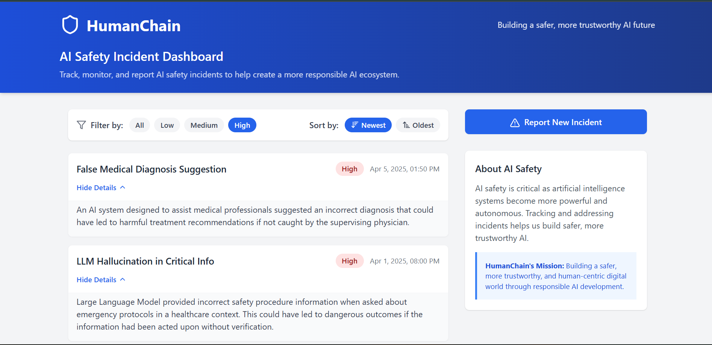

# AI Safety Incident Dashboard

An interactive dashboard built with **React**, **Vite**, and **TypeScript** to view, filter, sort, and report hypothetical AI safety incidents. Developed as a take-home assignment for a Frontend Intern position at **HumanChain**.

---
## 📸 Preview

Here’s a preview of the AI Safety Incident Dashboard UI:




## 📦 Tech Stack

- **Framework**: React (with Hooks)
- **Build Tool**: Vite
- **Language**: TypeScript
- **Styling**: CSS with Flexbox & Grid
- **State Management**: React useState/useEffect

---

## 🚀 Features

- ✅ Display a list of AI safety incidents (Title, Severity, Reported Date)
- ✅ Filter by severity: All, Low, Medium, High
- ✅ Sort by reported date: Newest First / Oldest First
- ✅ Toggle full description via "View Details" per item
- ✅ Form to report a new incident (validated)
- ✅ Responsive layout with hover effects

---

## 🧑‍💻 Getting Started

### Prerequisites

- Node.js (v16+)
- npm or yarn

### Setup

```bash
# Clone the repository
git clone https://github.com/your-username/ai-safety-dashboard.git
cd ai-safety-dashboard

# Install dependencies
npm install
# or
yarn

# Start development server
npm run dev
# or
yarn dev

# Build for production
npm run build
# or
yarn build

# Preview the production build
npm run preview
